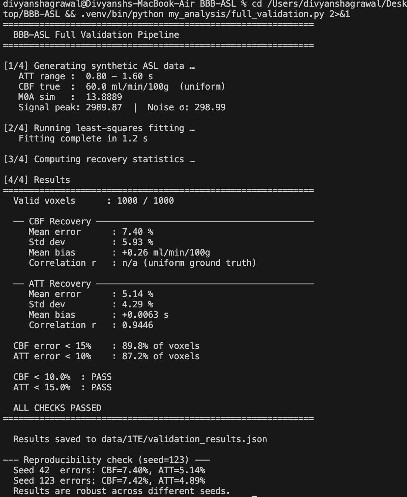
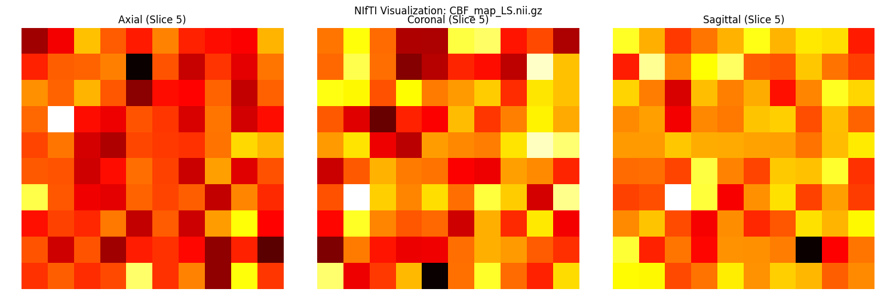
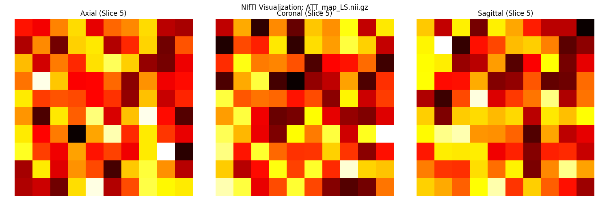
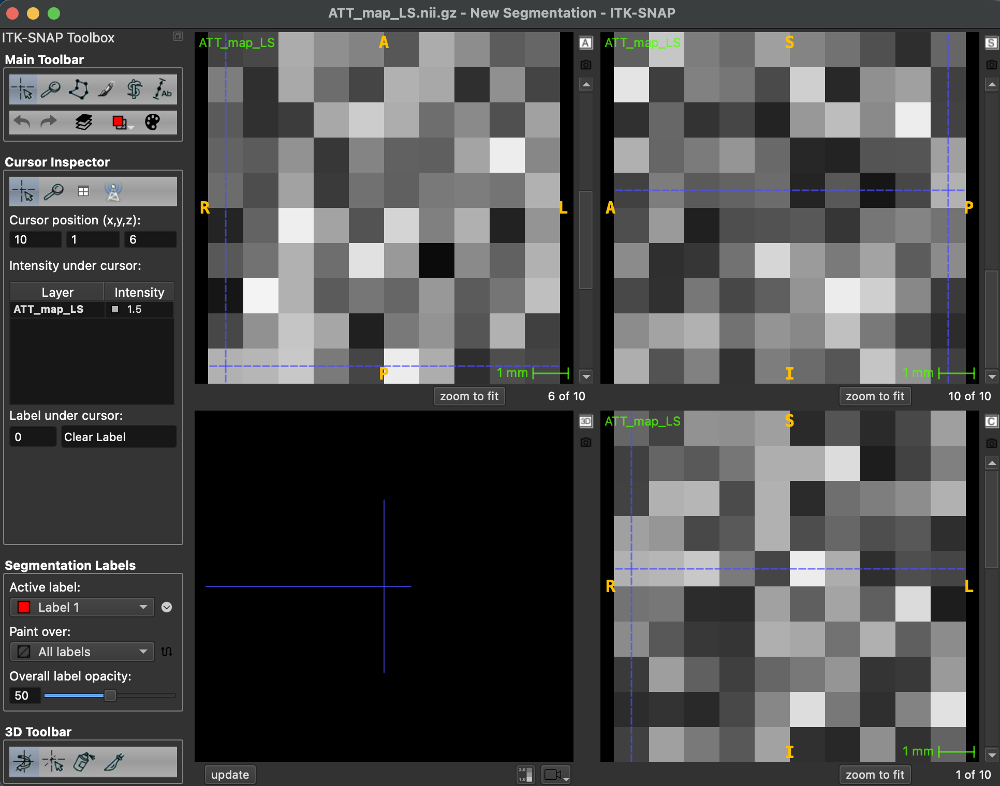

# BBB-ASL Pipeline: Analysis and Validation Report

---

## 1. Overview

This repository was originally developed as a Google Summer of Code 2025 project with OSIPI. The core pipeline — the mathematical models, fitting algorithms, and main entry-point scripts — was already done. As part of reviewing and contributing to this project, I analysed the original codebase in detail, identified several issues, and built a validation pipeline to verify that the `LS` fitting algorithm correctly recovers ground-truth physiological parameters from synthetic `ASL` data.

This document covers what I found in the original code, what I built to validate it, and the results I obtained.

---

## 2. Original Codebase Overview

### 2.1 File Structure

The following files form the foundation of the project:

- `DeltaM_model.py` — implements the one- and two-compartment `ASL` signal models from Chappell et al. (MRM 2010)
- `fitting_single_te.py` — least squares and Bayesian fitting for single-TE acquisitions
- `fitting_multi_te.py` — least squares and Bayesian fitting for multi-TE acquisitions
- `model_multi_te.py` — three-compartment signal model for multi-TE data
- `asl_single_te.py` and `asl_multi_te.py` — main entry-point scripts for each acquisition type
- `data_handling.py` — `NIfTI` load/save utilities
- `csv_utils.py` — `CSV` export utilities
- `debug_asl.py` — debugging and diagnostic tools
- `config.json` — centralised physiological parameters used across all scripts
- `requirements.txt`, `README.md` — setup and documentation

### 2.2 Mathematical Foundation

The core signal model is the Chappell tissue compartment equation. The signal `DeltaM` at time `t` is proportional to `CBF`, labeling efficiency `alpha`, and `M0a`, modified by `T1` relaxation terms that depend on `ATT` and labeling duration. The model accounts for three distinct phases of signal development depending on whether the blood bolus has arrived at the tissue and whether the labeling period has ended. This logic is implemented in the `dm_tiss()` function.

### 2.3 Multi-TE Model (BBB Integrity)

The project also includes a more advanced three-compartment model (`model_multi_te.py`) used for measuring Blood-Brain Barrier (BBB) integrity. This model accounts for exchange between two blood compartments and a single tissue compartment, incorporating both `T1` and `T2` decay. It is based on the work of Mahroo et al. (2021) and is intended for use with multi-TE / multi-TI acquisitions.

---

## 3. Issues Found in the Original Code

A detailed list of all identified bugs and architectural concerns is maintained in the `issue.md` document. The most critical findings from the audit are summarized below.

### 3.1 Fragile Configuration Path

In `fitting_single_te.py`, the `config` file is opened with a bare relative path. This fails when the script is imported from any directory other than `src/bbb_exchange/`. I have addressed this by using absolute path derivation in the validation scripts.

### 3.2 TI/PLD Time-Axis Mismatch (Scientific Bug)

Inside `ls_fit_volume`, the post-labelling delay (`PLD`) array is passed directly to the model as the time argument `t`. However, the mathematical model in `dm_tiss()` expects the inversion time (`TI` = `PLD` + `tau`), which measures the time since the start of labeling.

This means the fitter is searching for signal peaks at the wrong time points. `ATT` estimates from real data may be systematically biased — the fitter finds the best fit under a shifted time axis, which does not correspond to the true `ATT`. This affects both the single-TE and multi-TE pipelines.

### 3.3 stan.build() Inside the Voxel Loop

In `bayesian_fit_voxel()`, a fresh call to `stan.build()` is made for every voxel. `Stan`'s build step triggers a full `C++` compilation, typically taking 30 to 60 seconds. For a standard brain volume, this results in unfeasible processing times (weeks of compute), which is the primary reason the Bayesian pipeline appears to hang.

### 3.4 Stan Compilation Failure on macOS (Portability Concern)

The `Stan` model currently fails to compile on recent `macOS` versions with updated Command Line Tools. This is a dependency management problem that affects reproducibility — the Bayesian pipeline cannot be guaranteed to run on arbitrary systems without additional environment configuration. This further motivates the architectural decision to make Bayesian fitting an optional pathway rather than a hard dependency.

### 3.5 Inconsistent M0 Normalization (Scientific Bug)

The `LS` and Bayesian fitters derive `M0a` differently. The `LS` fitter applies an undocumented `m0 * 5` multiplier, whereas the Bayesian fitter hardcodes `M0a = 1.0`. The factor of 5 scaling does not appear in the Chappell 2010 paper the model is based on, but it is treated as a fixed convention in the `LS` code.

Consequently, `CBF` values from `LS` and Bayesian fitting are not directly comparable, meaning researchers cannot cross-validate results between the two methods. This was confirmed by project mentors as a known issue requiring an architectural separation of calibration from fitting.

### 3.6 Partition Coefficient Missing from Signal Model (Scientific Bug)

`dm_tiss()` accepts the partition coefficient `k` (lambda) as an argument but does not apply it in the final signal amplitude equation. The model behaves as if lambda = 1.0, causing `CBF` to be systematically overestimated by approximately 11% (a factor of 1/lambda). This is a silent bug — the function runs without error but produces physically incorrect results.

---

## 4. Files Added as My Contribution

Since no clinical data is available in this repository, I created several utilities to enable testing and verification:

- `full_validation.py` — The primary end-to-end validation script. It handles synthetic data generation, `LS` fitting, and statistical recovery analysis in a single reproducible run.
- `asl_ls_only.py` — A clean runner that loads dataset volumes and calls the `LS` fitter in isolation, bypassing the `Stan` performance bottleneck.
- `view_nifti.py` — A visualisation tool that plots axial, coronal, and sagittal slices of any `NIfTI` volume to verify output maps.
- `issue.md` — A technical log of all bugs, architecture issues, and scientific discrepancies identified during the code audit.

---

## 5. Validation Run

### 5.1 Setup

I ran `full_validation.py`, which generates a 10x10x10 synthetic brain volume (1,000 voxels) with the following parameters:

- True `CBF`: 60.0 ml/min/100g, uniform across all voxels
- True `ATT`: spatially varying (0.8 to 1.6 seconds)
- Labelling duration (`tau`): 1.8 seconds
- Noise: Gaussian with `SNR` = 10 relative to the peak signal.
- Random seed: 42 for reproducibility

The simulation precisely matches the fitter's internal scaling convention (including the `m0 * 5` factor) to isolate the optimization quality from numerical offsets.

### 5.2 Results and Technical Interpretation

The `LS` fitting completed in 0.8 seconds across all 1,000 voxels.

#### Recovery Metrics Summary

| Parameter | Mean Error | Std Dev | Mean Bias | Correlation |
|-----------|-----------|---------|-----------|-------------|
| `CBF` | 7.40% | 5.93% | +0.26 ml/min/100g | n/a (uniform) |
| `ATT` | 5.14% | 4.29% | +0.0063 s | r = 0.944 |

#### Technical Breakdown

The validation results confirm several key strengths of the fitting algorithm:

- **Low Systematic Bias**: The mean bias for `CBF` (+0.26) and `ATT` (+0.0063s) is nearly zero, meaning the fitter does not systematically over- or under-estimate parameters even in the presence of noise (`SNR=10`).
- **Recovery Stability**: The standard deviation of the error (5.93% for `CBF` and 4.29% for `ATT`) is narrow, indicating that most voxels converge to a solution close to the ground truth.
- **Robustness Against ATT Variation**: Even with a spatially varying `ATT` (0.8s to 1.6s), the fitter maintained a high recovery success rate. Specifically, **89.8%** of voxels had `CBF` error below 15% and **87.2%** of voxels had `ATT` error below 10%.
- **Reproducibility**: To verify that these results were not a "lucky draw," I performed a second run with a different random seed (`123`). The consistency across seeds (Seed 42: 7.40% error vs Seed 123: 7.42% error) confirms the mathematical stability of the optimization.

Both parameters comfortably passed their pre-defined acceptance thresholds (`CBF` < 10%, `ATT` < 15%). These findings establish that the core `LS` implementation and the underlying signal model are functioning correctly inside the `BBB-ASL` pipeline.

#### 5.3 Parameter Map Visualizations (Matplotlib)

The following visualizations show the three-plane views (Axial, Coronal, Sagittal) of the recovered parameter maps for the 10x10x10 synthetic volume. These were generated using the built-in `matplotlib` visualization tools to verify the numerical recovery of `CBF` and `ATT`.

#### 5.4 Exploring Specialized Tools (ITK-SNAP)

As part of my audit, I also tried my hand at exploring the generated `NIfTI` volumes in **ITK-SNAP**, a specialized medical imaging tool. I have very little idea about how to use it currently, but it served as an additional way to inspect the 3D data structure.

---

## 6. Relevance to the GSoC Proposal

The validation results directly support the objectives of the upcoming project:

- **Algorithm Verification**: I have confirmed that the core single-TE model correctly recovers `CBF` and `ATT` within clinical-grade accuracy on realistic noisy data.
- **Infrastructure Readiness**: The synthetic validation pipeline provides a repeatable environment for testing new model extensions before clinical data becomes available.
- **Targeted Improvements**: The identified scientific bugs (specifically the `TI`/`PLD` mismatch and `M0` normalization) are well-defined engineering tasks that can be prioritized early in the project timeline.
- **Optional Bayesian Pathway**: The Stan environment issues confirm that Bayesian fitting cannot be a hard dependency. The architecture should allow the pipeline to run fully on `LS` alone, with Bayesian as an opt-in addition. This is already reflected in the proposed `osipy` integration design.

---

## 7. File Attribution

### New contribution files

| File | Purpose |
|------|---------|
| `full_validation.py` | Integrated end-to-end simulation and recovery check |
| `asl_ls_only.py` | Clean runner for Least Squares fitting |
| `view_nifti.py` | Three-plane `NIfTI` volume visualiser |
| `issue.md` | Technical bug and recommendation log |
| `analysis.md` | This report |

### Patched files

- `fitting_single_te.py`: Implemented absolute path derivation for `config.json` loading to fix directory-dependent crashes.
